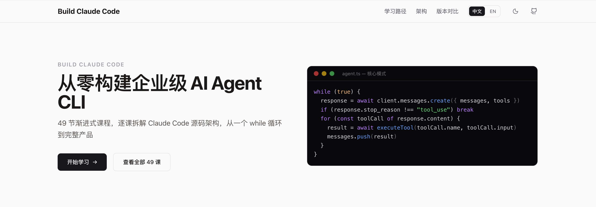

<p align="center">
  <h1 align="center">Build Claude Code</h1>
  <p align="center">
    <strong>从零构建企业级 AI Agent CLI — 逐课拆解 Claude Code 源码架构</strong>
  </p>
  <p align="center">
    🌐 <a href="https://build.funagent.app">官网</a> · 📖 <a href="./CONTRIBUTING.md">贡献指南</a> · 🐛 <a href="https://github.com/funAgent/build-claude-code-cli/issues">反馈问题</a>
  </p>
</p>

<p align="center">
  <a href="https://github.com/funAgent/build-claude-code-cli/stargazers"></a>
  <a href="https://github.com/funAgent/build-claude-code-cli/network/members"></a>
  <a href="https://github.com/funAgent/build-claude-code-cli/commits"></a>
  <a href="./LICENSE"></a>
  
  
  
</p>

---

## ⚠️ 免责声明

本项目**仅用于学习交流**，内容基于互联网上公开的 Claude Code 技术分析资料及[learn-claude-code](https://github.com/shareAI-lab/learn-claude-code) 项目提供的灵感整理构建而成。所有课程代码均为独立编写，仅供教学演示，不建议直接用于生产环境。

> "Claude Code" is a trademark of Anthropic. This project is not affiliated with or endorsed by Anthropic.

## 这是什么？



49 节渐进式课程，教你从 `npm init` 开始，逐课构建出一个架构对标 [Claude Code](https://github.com/anthropics/claude-code) 的完整 AI Agent CLI 产品。

**核心模式只有一个 while 循环：**

```typescript
while (true) {
  response = await client.messages.create({ messages, tools })
  if (response.stop_reason !== "tool_use") break
  for (const toolCall of response.content) {
    result = await executeTool(toolCall.name, toolCall.input)
    messages.push(result)
  }
}
```

每一课产出一个可独立运行的项目快照，从第一课的 API 调用到最后一课的遥测诊断，最终你会拥有一个完整的、可安装分发的 AI Agent CLI。

## 快速开始

```bash
# 克隆项目
git clone https://github.com/funAgent/build-claude-code-cli.git
cd build-claude-code-cli

# 运行任意一课的代码
cd agents/s03-agent-loop
npm install
npx ts-node src/agent-loop.ts

# 启动教学网站
cd web
npm install
npm run dev
# 访问 http://localhost:3000
```

**前置要求：** Node.js ≥ 18 · npm ≥ 9 · Git

## 课程大纲

现在 [开始学习](https://build.funagent.app/)

| # | 阶段 | 课程 | 关键能力 |
|---|------|------|---------|
| 0 | 预备知识 | s00 – s02 | API 调用、CLI 脚手架、子进程管理 |
| 1 | 最小 Agent | s03 – s07 | Agent 循环、消息管理、错误处理、配置、成本追踪 |
| 2 | 工具体系 | s08 – s12 | 工具抽象、文件读写、编辑、搜索、工具注册表 |
| 3 | 终端 UI | s13 – s16 | Ink 组件、消息列表、输入框、完整 REPL |
| 4 | Prompt 工程 | s17 – s19 | 系统提示词、CLAUDE.md 规则、Prompt Cache |
| 5 | 流式与性能 | s20 – s23 | Streaming 解析、Token 流、并行工具、启动优化 |
| 6 | 上下文管理 | s24 – s26 | 对话压缩、多层策略、大输出处理 |
| 7 | Agent 智能 | s27 – s31 | 规划能力、子 Agent、技能系统、任务管理 |
| 8 | 安全与权限 | s32 – s34 | 规则引擎、权限 UI、子 Agent 权限继承 |
| 9 | 扩展生态 | s35 – s38 | MCP 协议、会话持久化、插件系统 |
| 10 | 多 Agent | s39 – s43 | Agent 定义、协调器、团队协作、通信协议、Worktree 隔离 |
| 11 | 产品化 | s44 – s48 | 渐进恢复、Feature Flag、打包分发、原生能力、遥测诊断 |

## 项目结构

```
build-claude-code-cli/
├── agents/              # 49 课 TypeScript 实现（每课独立可运行）
│   ├── s00-api-basics/
│   ├── s01-cli-scaffold/
│   ├── ...
│   └── s48-telemetry-diagnostics/
├── docs/                # 教学文档
│   ├── zh/              # 中文（49 篇）
│   └── en/              # English
├── web/                 # Next.js 教学网站
│   └── src/
│       ├── app/         # 页面路由
│       ├── components/  # UI 组件（源码查看器、Diff、终端播放器等）
│       ├── data/        # 场景、注解、终端录制数据
│       └── lib/         # 工具函数、常量、i18n
├── reference/           # Claude Code 架构参考笔记
├── PLAN.md              # 详细规划文档
├── TODO.md              # 开发进度追踪
└── CONTRIBUTING.md      # 贡献指南
```

## 教学网站功能

- **交互式源码查看器** — 语法高亮 + 逐课 Diff 对比
- **终端录制播放器** — 模拟真实 CLI 交互过程
- **架构全景图** — 可视化展示模块关系与分层结构
- **深度注解** — 每课的架构决策与 Claude Code 源码映射
- **学习进度追踪** — 本地持久化的完成状态
- **中英文切换** — 完整的双语支持
- **暗色模式** — 自动跟随系统偏好

## 技术栈

**教学项目：** TypeScript · Node.js · Commander.js · React + Ink · Anthropic SDK · Zod · esbuild · MCP SDK

**教学网站：** Next.js 16 · React 19 · Tailwind CSS v4 · Framer Motion · unified (Markdown 渲染)

## 贡献

欢迎贡献！请阅读 [CONTRIBUTING.md](./CONTRIBUTING.md) 了解如何：

- 修改现有课程内容
- 添加新的知识内容
- 确保课程间的一致性

## 贡献者

<a href="https://github.com/funAgent/build-claude-code-cli/graphs/contributors">
  
</a>

## 关于我


欢迎👏扫码关注我！

## Star History

<a href="https://star-history.com/#funAgent/build-claude-code-cli&Date">
 <picture>
   <source media="(prefers-color-scheme: dark)" srcset="https://api.star-history.com/svg?repos=funAgent/build-claude-code-cli&type=Date&theme=dark" />
   <source media="(prefers-color-scheme: light)" srcset="https://api.star-history.com/svg?repos=funAgent/build-claude-code-cli&type=Date" />
   
 </picture>
</a>

## 许可证

[MIT](./LICENSE) © [funAgent](https://github.com/funAgent)
